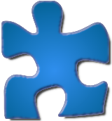

# Jigsaw Puzzle Piece—Object Model

Utilizing the principles of object-oriented programming (OOP) each piece of the puzzle will be represented as an individual object. The properties for each piece will be reduced to numerical representations to assist in rapid lookup and mathematical transformations.

## Attributes

### *id*: integer

All pieces in the puzzle will be assigned a consecutive number as an ID. This will start at with upper-left corner piece as piece 0; counting to the right and then down making the lower-right corner n-1. Keeping pieces in a 1D array will reduce data relations.

During testing with command line scripts, to keep pieces more easily identified, the test scripts will convert user input of standard 2D spreadsheet notation of letter-number pairs to the 1D array IDs. That way, I don't have to remember column counts and compute columns in my head.

### *anchor*: tuple (x, y)—integers

A standard *x*, *y* anchor will position the piece on a desktop canvas or within a container. The anchor point will be located in the center of the piece to keep geometric transformations simple. This will be used with additional properties to determine when to draw a piece, as well as to calculate collisions and snapping.

Note: *x* and *y* will be standard graphic positions with pixel 0, 0 being the upper-left corner and x-1, y-1 the lower-right corner.

### *size*: tuple (width, height)—integers

Each piece will be "cut" along standard grid-based corners based on the closest calculated pixel. The user enters the desired piece count and provides the picture of any dimension. Math will determine the closest actual piece count that matches the picture dimension and keeps initial width and height as close to even as possible. 

The actual width and height for each piece will be calculated further depending on which sides have tabs vs. blanks and even if curves protrude outside the grid line.  The size of each piece will be used to calculate when it is within view as well as for collisions and snapping.

### *side.top*, *.right*, *.bottom*, *.left*: list [[(x, y),(x, y),(x, y),(x, y)],...] 

Each edge will consist of one- or four-segment Cubic Bézier curves. Each segment contains four tuples representing *x* and *y* values for two anchor points and two control points relative to the center anchor. Straight sides of edge and corner pieces only need one line segment from corner to corner. All other cuts include four segments.

Cutting will occur for individual pieces starting with the upper-left corner piece moving row by row from top to bottom. Each piece will only need to cut its right and bottom sides (cutting clockwise). Following pieces will inherit their top and left cuts but will reverse the data such that a continuous polygon shape can be drawn clockwise for the image fill. Edge and corner pieces will skip cut procedures for their flat sides.

Random variance of middle anchor points will be built into the generation methods to create distinct shapes for each cut, so no two shapes will be the same. Initial cut generation will enforce collinear (straight) control point handles along middle anchor points to guarantee smooth transitions. Control points for corners will initially overlap anchors to keep corners crisp. Future refinement phases will experiment with angular (cusp) handles at the middle anchors and extended control points on the corners to introduce sharper geometric features, according to my pleasure.

### *rotation*: integer

The rotation will be a value from 0 to 359 representing the visual rotation on the screen. Game settings will allow the user to set no rotations (0) or any value from 1 to 90 to control the rotational granularity.  With 90 being standard for puzzle software allowing rotations set at 0, 90, 180, and 270 degrees keeping sides of pieces vertical and horizontal.

### *shape*: integer

The shape attribute is a completely arbitrary designation based on my own real-life experience as a puzzler. This must be explained in more detail in a separate doc. See [Standard Shape Orientation](/Shapes.md).

### *rotation_offset*: integer

The rotation offset will be used as a mathematical aid in handling [Standard Shape Orientation](/Shapes.md).

### *color_profile*: TBD

This data is still in the imagination phase. The intent is to create some method of auto-sorting pieces based on a color profile. Easy to picture would be a scenic puzzle with sky pieces in one container, background landscape in another, buildings in one, animals in another, etc. A far different scenario with a colorful texture as the image, such as a bowl of hard-tack candy, presents more of a challenge. 

I may experiment with mean, median, and mode of pixel colors. Or, down the road, feed the image into a convolutional neural network (CNN) for image recognition and sorting individual pieces based on what can be recognized as it is most a part of.

### *layer*: signed integer

The layer (or Z-index) attribute will be for user override of default behavior. By default, the higher the ID value the higher up on the visibility stack, but all will start on a Z-index of 0. A user may move pieces to a higher or lower layer (+ or - Z-index) to handle what is visible when things are overlapped. This is strictly a visual designation. Pieces will not need to be on the same layer to connect; though connected pieces will become the higher or most visible of the two layers when there is a mismatch.

### *container*: integer

This will relate to the ID of the container the piece is currently in: 0 for game desktop canvas, 1-100 specified containers based on key mapping. For more information see [Containers](/Containers.md).

### *connection*: integer

This will relate to the key of the connection grouping. Initial planning of design is to store connected groups as lists of piece IDs to a numerically keyed dictionary. See [Connections](/Connections.md).

### *is_selected*: boolean

Flags if a piece is part of a selected set.

### *is_focused*: boolean

Flags if the current piece is the focus of the mouse (based on the upper-most piece with visible pixel located at the current mouse position). The manner of finding this has yet to be decided, but the intent is to ignore transparent pixels within the width and height of a piece.

## Methods

### *rotate(step)*

This method is for the user interaction of rotating pieces (automated tools will access attributes directly). The *step* parameter will be a multiplication of the configured rotation granularity and mouse speed. The initial plan is for the mouse scroll-wheel to initiate rotations of whichever is the top piece the mouse is hovering over. Scrolling down rotates clockwise, up rotates counter-clockwise by the number of degrees passed in *step*.

If multiple pieces have been selected the rotation will be passed to all the selected pieces.

### *draw()*

Initial design will set the draw method on each piece to render the individual piece. This may be moved to the desktop (or container canvas in view) depending on testing. The idea will be to handle grabbing the correct section of the picture for the piece, scaling it to the current view window, and rendering it based on its position and rotation.

### *move_to(x=None, y=None, container=None, grid=False)*

Specify where to move a piece. Different calls may update the anchor point *x*, and *y* values and/or the *container* ID.  A simple sort key-binding would call move_to(container=#) based on the number key tapped keeping its same position in the container. Other calls my update the anchor point keeping in the same container, or may move from one container to another changing the anchor point. Finally, setting *grid* to true will position the piece in the first empty grid space of the container allowing pieces to be sorted and positioned for easy visual scanning with one interaction.

---

There may be many more methods that present themselves as tests and implementation merge together.